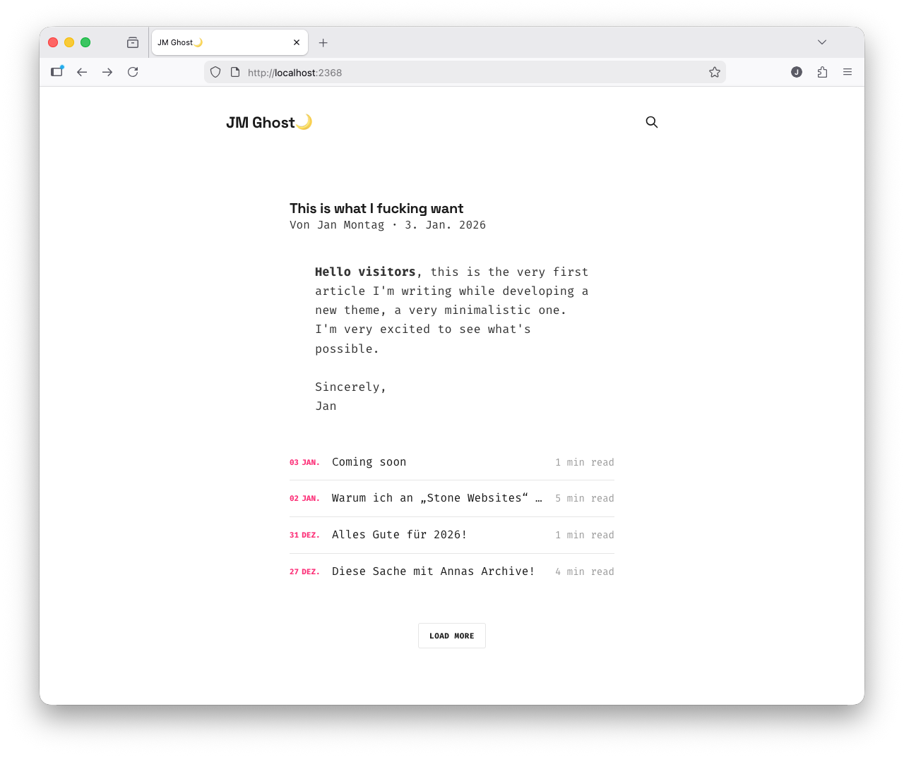

# Ghost Theme JM Ghost

(First push 03.01.2026)

Welcome to my Ghost CMS Theme **JM Ghost**. It is a very minimalistic Theme for short notes. I reduced all the capacity of Ghost CMS to look as clean and minimal at it is possible.

Hope you enjoy.

### Anpassungen am Dawn-Theme

## CSS-Modifikationen

| Datei | Änderung | Zweck | Code |
| :--- | :--- | :--- | :--- |
| `assets/css/general/grid.css` | `.gh-canvas` Regel überschrieben | Begrenzt Inhaltsbreite auf 800px | `.gh-canvas { grid-template-columns: ... }` |
| `assets/css/screen.css` | Neue Klassen hinzugefügt | Styling für Startseiten-Layout | `.gh-article-full { margin-bottom: 4rem; }` |
| `templates/index.hbs` | Template komplett ersetzt | Zeigt neuesten Artikel vollständig, dann Liste | [Siehe separate Datei] |

This Theme is based on the Dawn Ghost CMS Theme.